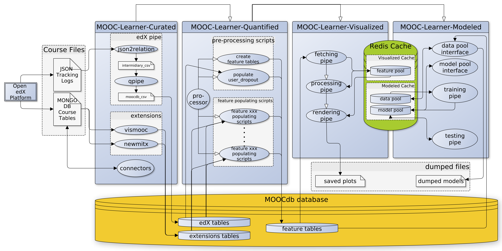
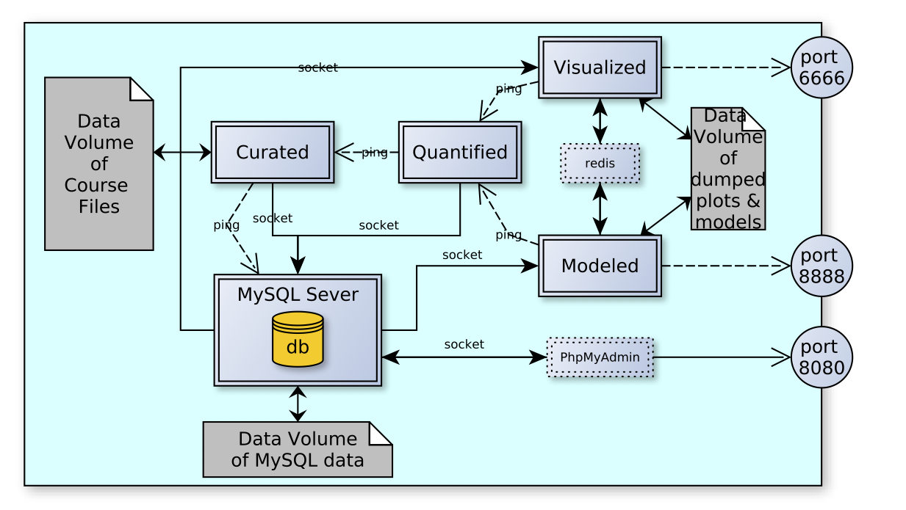
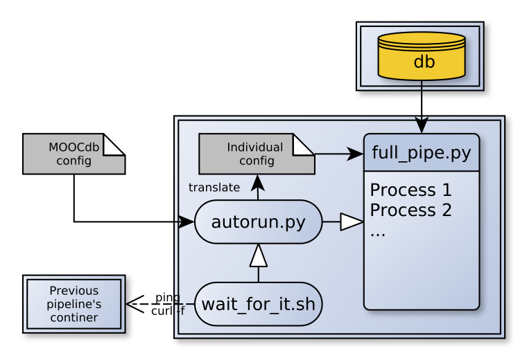

# MOOC-Learner-Pipeline

The MOOC-Learner-Pipeline is embedded into docker containers with unified configurations. MOOC-Learner-Docker 
contains 4 repositories as sub-modules. 

MOOC-Learner-Docker provides:
- Integrated package requirements, MySQL settings and connections of the host server
- Combination of all configuration settings of all 4 repositories into one file (config/config.yml) so easy to change 
and inspect
- Ability to run through the entire pipeline with one command and no need to interact with them during processing
- Enables setting up continuous integration server (Jenkins) for automatic testing on synthetic data (one simple 
synthetic generator is provided)
- Ability to run the full pipeline in parallel on multiple courses without reducing the I/O speed of MySQL of one pipeline
- Preserves the original entry-point (`full_pipe.py`) and verbose execution mode, for easy developing and debugging

# MOOC-Learner-Pipeline Detailed view

The detailed work flow of the complete MOOC-Learner-Project's pipeline. White arrows represent control flow and black 
arrows represent data pipes.

## Configuration

The entire MOOC-Learner-Pipeline can be configured by a single YAML file (`config/config.yml`). It includes 4 parts:
- Database and workspace configuration
- MySQL server configuration
- Pipeline configuration
- Raw data file configuration

The user will only need to change the pipeline and raw data file configuration. Note that the raw data file config is 
only used by MOOC-Learner-Curated.

## Docker Networking and Data Volumes

Flow chart of docker networking and volumes I/O. Dashed line represent communication without course data which solid 
line represent data processing pipes.

## Structure inside a MOOC-Learner-Pipeline Docker Container

All of the 4 docker containers have identical control-flow structures. They use a shell script `wait_for_me.sh` to 
control their relative execution order. The all have a python script `autorun.py` serving as the entry-point, which 
transform the project config file into its own config file. `autorun.py` then executes `full_pipe.py`
 (possibly in parallel), which only requires the repositories' individual config file.

## Docker-Compose file

The `docker-compose.yml` file is used by docker-compose to setup the containers. Generally users should only change two 
entries in this file for configuration. They are
- the directory which binds to MySQL container's data directory
- the root directory containing course data files
Only if you want to run curated, the path to course data files is necessary. We do not save the MySQL tables inside the 
container itself, otherwise you cannot reuse it when you re-run the MOOC-Learner-Project with a modified configuration.
 After running through curated, you can simply switch courses by changing the path to MySQL data directory.

## Container connections

To protect sensitive data, we do not expose MySQL container's port so generally it cannot be accessed by anyone else 
outside the host server. But sometimes we want to manipulate the database manually and may use auxiliary services
 like PhpMyAdmin. Those containers will bind its port to the host's port and consequently exposing the database 
 to the outside. In this case, we protect our data by MySQL server's logins and the configuring the `iptables` inside 
 those containers.

## Comparison and Transferring among Courses

On single course's data (It can be extended for multiple courses by adding a `course_id` field to the MySQL tables.) 
We visualize results and transfer classifier models among courses by dumping the plots and models to a shared data 
volume and loading them later when you run MOOC-Learner-Pipeline on an another course. The objects you dump is not 
bare `matplotlib` figures or `scikitlearn` classifiers, but a wrapper classes which provide more detailed 
information about the plots and models. For example, we store the training and testing history, set of features it fits 
on, and performances of a model along with the  model itself.

## Connecting to VisMOOC

[VisMOOC](https://github.com/HKUST-VISLab/vismooc) only requires curated to populate the edX tables and 
`vismooc_extension` tables. We can connect VisMOOC to our MOOC-Learner-Docker by changing VisMOOC's MySQL configurations
 and run it together with curated and MySQL containers under one docker network. A combined docker-compose file is 
 located in `/VisMOOC-Docker` folder. A separated MOOC-Learner-Project config file is also provided in 
 `/VisMOOC-Docker/moocdb_config/` to configure curated which serves as a pre-processing step now.
